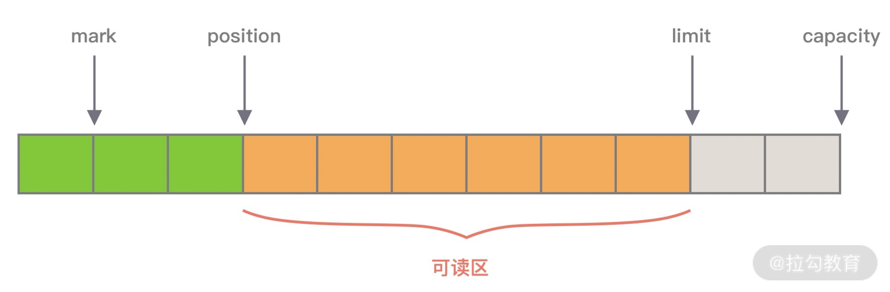
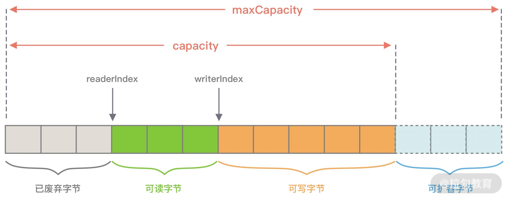

## 堆外内存
堆外内存分配的方式: (参考: io.netty.learn.BufferLearn.byteBufferTest)
1. ByteBuffer#allocateDirect
2. Unsafe#allocateMemory

`ByteBuffer`

mark：为某个读取过的关键位置做标记，方便回退到该位置；
position：当前读取的位置；
limit：buffer 中有效的数据长度大小；
capacity：初始化时的空间容量。
以上四个基本属性的关系是：mark <= position <= limit <= capacity。

`ByteBuf`

优点:
容量可以按需动态扩展，类似于 StringBuffer；
读写采用了不同的指针，读写模式可以随意切换，不需要调用 flip 方法；
通过内置的复合缓冲类型可以实现零拷贝；
支持引用计数；
支持缓存池。

引用计数对于 Netty 设计缓存池化有非常大的帮助，当引用计数为 0，
该 ByteBuf 可以被放入到对象池中，避免每次使用 ByteBuf 都重复创建，对于实现高性能的内存管理有着很大的意义。

ByteBuf 分类:
Heap/Direct: 就是堆内和堆外内存。
Pooled/Unpooled: 表示池化还是非池化内存。
Unsafe/非 Unsafe: 的区别在于操作方式是否安全。

操作的API:
readerIndex() & writeIndex()
readerIndex() 返回的是当前的读指针的 readerIndex 位置，writeIndex() 返回的当前写指针 writeIndex 位置。

markReaderIndex() & resetReaderIndex()
markReaderIndex() 用于保存 readerIndex 的位置，resetReaderIndex() 则将当前 readerIndex 重置为之前保存的位置。

## 内存
集成在SizeClass 枚举中
tiny
small
normal
huge

`Chunk` 是 Netty 向操作系统申请内存的单位，所有的内存分配操作也是基于 Chunk 完成的，Chunk 可以理解为 Page 的集合，每个 Chunk 默认大小为 16M。
`Page` 是 Chunk 用于管理内存的单位，Netty 中的 Page 的大小为 8K，不要与 Linux 中的内存页 Page 相混淆了。
假如我们需要分配 64K 的内存，需要在 Chunk 中选取 8 个 Page 进行分配。
`Subpage` 负责 Page 内的内存分配，假如我们分配的内存大小远小于 Page，直接分配一个 Page 会造成严重的内存浪费，
所以需要将 Page 划分为多个相同的子块进行分配，这里的子块就相当于 Subpage。按照 Tiny 和 Small 两种内存规格，
SubPage 的大小也会分为两种情况。在 Tiny 场景下，最小的划分单位为 16B，按 16B 依次递增，16B、32B、48B ...... 496B；
在 Small 场景下，总共可以划分为 512B、1024B、2048B、4096B 四种情况。Subpage 没有固定的大小，需要根据用户分配的缓冲区大小决定，
例如分配 1K 的内存时，Netty 会把一个 Page 等分为 8 个 1K 的 Subpage。